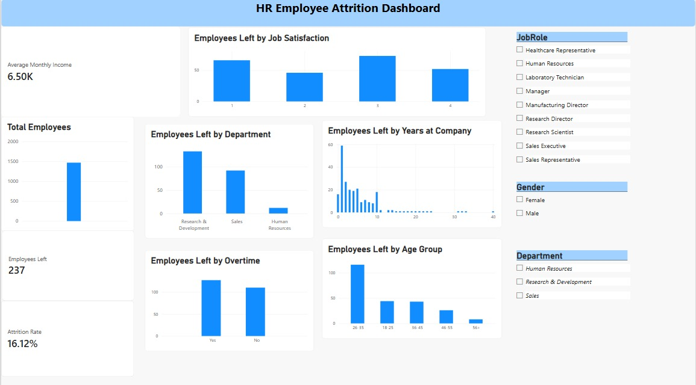

# HR Employee Attrition Analysis & Power BI Dashboard

## Project Overview

This project analyzes employee attrition using Python, SQL, and Power BI to identify patterns and factors associated with employee turnover.

The project covers data cleaning, exploratory data analysis, SQL-based analysis, KPI calculation, and interactive Power BI dashboard development.

## Objective

- Analyze employee attrition patterns.
- Identify departments and employee groups with higher attrition.
- Examine the relationship between overtime, job satisfaction, income, age, and attrition.
- Build an interactive Power BI dashboard for HR analysis.
- Present key findings in a clear and business-friendly format.

## Dataset

The dataset contains **1,470 employee records** with information related to:

- Employee demographics
- Department
- Job role
- Job satisfaction
- Monthly income
- Overtime
- Years at company
- Age
- Attrition

After data cleaning, the dataset contains **33 columns**.

## Tools & Technologies

- Python
- Pandas
- NumPy
- Matplotlib
- SQL
- Google Colab
- Power BI
- DAX

## Data Cleaning & Preparation

The dataset was cleaned and prepared using Python and Pandas.

The following steps were performed:

- Inspected dataset structure and data types.
- Checked for missing values.
- Checked for duplicate records.
- Identified and removed unnecessary constant and identifier columns.
- Created analysis-ready categories such as `AgeGroup`.
- Validated employee and attrition counts after cleaning.

## Exploratory Data Analysis

The analysis examined employee attrition across multiple dimensions:

- Department
- Overtime
- Age group
- Job satisfaction
- Monthly income
- Years at company
- Job role

SQL queries were also used to calculate employee counts and income statistics by attrition status.

## Power BI Dashboard

An interactive Power BI dashboard was developed to visualize employee attrition and related HR metrics.

### Key Performance Indicators

| Metric | Value |
|---|---:|
| Total Employees | 1,470 |
| Employees Left | 237 |
| Attrition Rate | 16.12% |
| Average Monthly Income | 6.50K |

### Dashboard Visuals

- Total Employees
- Employees Left by Department
- Employees Left by Overtime
- Employees Left by Age Group
- Employees Left by Job Satisfaction
- Employees Left by Years at Company
- Job Role slicer
- Gender slicer
- Department slicer

## Key Findings

- Employees working overtime had a **30.53% attrition rate**, compared with **10.44%** for employees who did not work overtime.
- Attrition rates varied by department, with **Sales at approximately 20.6%**, **Human Resources at approximately 19.0%**, and **Research & Development at approximately 13.9%**.
- The **18–25 age group** had an attrition rate of approximately **35.77%**.
- Job Satisfaction level 1 had an attrition rate of approximately **22.84%**.
- Employees who left had a lower average monthly income (**4,787**) than employees who stayed (**6,833**).

## Project Structure

```text
HR-Employee-Attrition-Analysis/
│
├── HR_Employee_Attrition_Analysis.ipynb
├── HR_Employee_Attrition_Dashboard.pbix
├── employee_attrition_cleaned.csv
├── dashboard.png
└── README.md

## Dashboard Preview



## Conclusion

This project demonstrates an end-to-end data analytics workflow, from data cleaning and exploratory analysis to SQL analysis and interactive Power BI dashboard development.

The analysis provides HR-focused insights into employee attrition and highlights factors such as overtime, department, age, job satisfaction, and income that can be further investigated to understand employee turnover.


